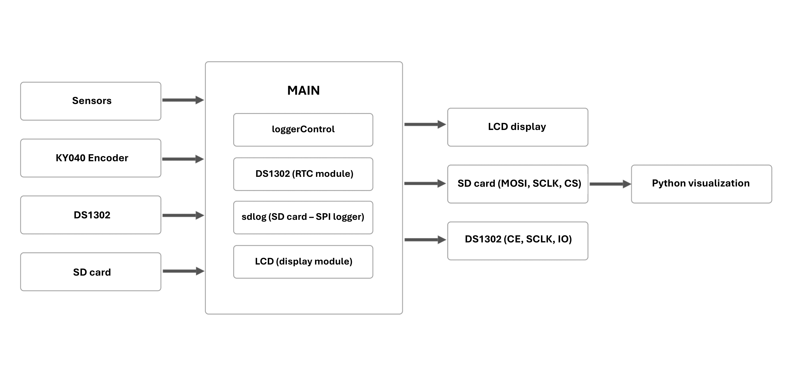
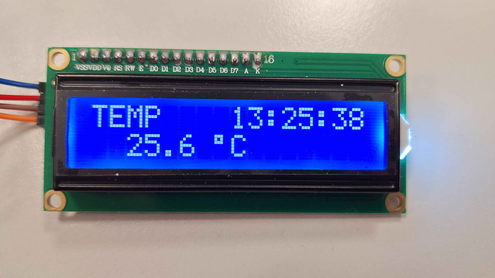
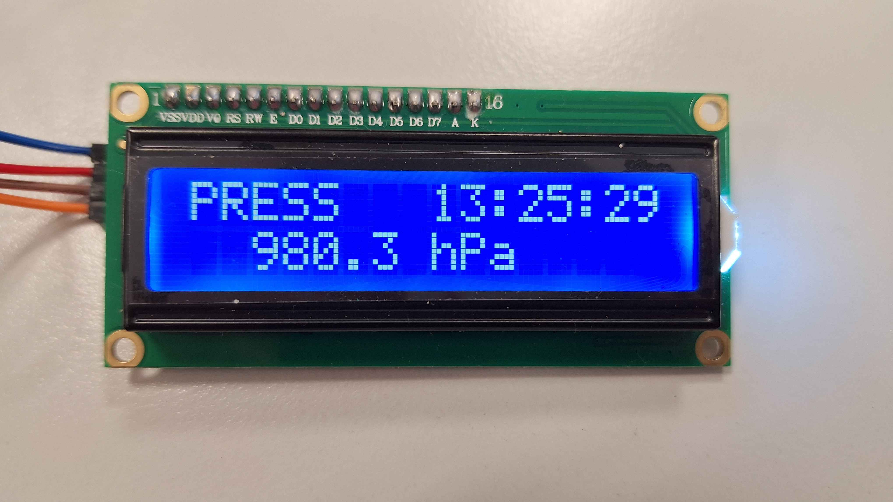
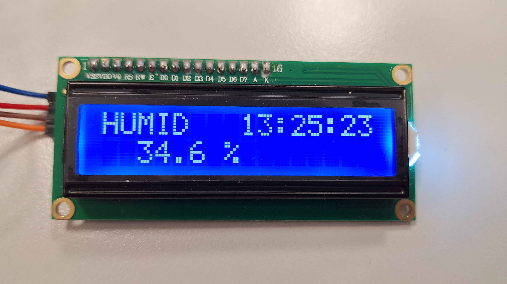
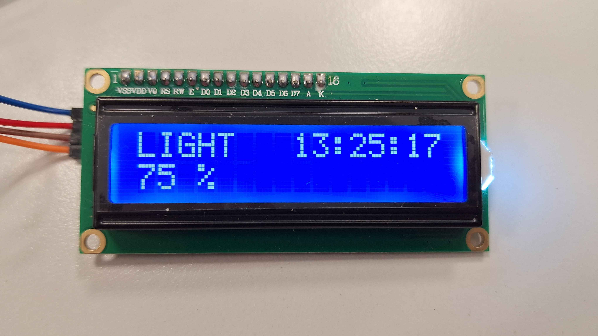
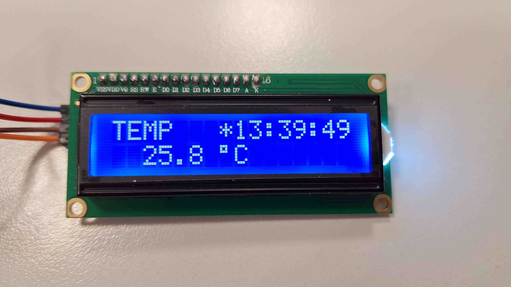

# DE2 Data logger project

### Team members

* Matyas Heneberk (responsible for lightsensor code & creating block diagram & video editing & poster creation)
* Vojtěch Šafařík (responsible for data logging & RTC implementation & Python visualisation script & creating the flowchart & managing GitHub repository)
* Martin Zatloukal (responsible for BME280 code & data logging & RTC implementation & Doxygen documentation & Python visualisation scripts)

### Abstract
This project focuses on creating a portable environmental data logger implemented on an Arduino UNO board using the toolchains provided by PlatformIO. The data logger displays the measured environmental data (temperature, humidity, barometric pressure and light) on a display. By pressing an encoder button, the data logger starts collecting the data to an SD card, which can then be visualised by a Python script on a computer. The SD card data logging uses the Petit FAT File System Module, a lightweight subset of FatFs written in ANSI C.

[**Video demonstration of our project**](https://youtu.be/T6lY70KSE_c)

## List of hardware components

* BME280 module
  - air pressure, temperature and humidity sensor combined within one small module

* Fotoresistor
  - simple light sensor
 
* RTC module DS1302
  - accurate and low-cost solution for keeping time when the data logger is powered off
  
* I2C LCD Display 1602
  - indication of current measurements without the need of computer

* Rotary encoder KY040
  - provides rotary selection and a clickable button in one simple module

* SD Card module
  - used for connecting SD card

## Components schematics
 add here or remove

## Pinout Configuration

| Interface Group | Pin Name | Arduino Pin | AVR Port | Connected Components |
| :--- | :--- | :--- | :--- | :--- |
| **I2C Bus** | **SDA** | **A4** | PC4 | **LCD 1602** (Addr: `0x27`)   **BME280** (Addr: `0x76`) |
| | **SCL** | **A5** | PC5 | |
| **SPI Bus** | **SCK** | **D13** | PB5 | **SD Card Module** |
| | **MISO** | **D12** | PB4 | |
| | **MOSI** | **D11** | PB3 | |
| | **CS** | **D4** | PD4 | |
| **RTC (DS1302)** | CLK | **D8** | PB0 | **RTC** |
| | DAT | **D9** | PB1 | |
| | RST | **D10** | PB2 | |
| **Controls & UI** | CLK | **D5** | PD5 | **Rotary Encoder** |
| | DT | **D6** | PD6 | |
| | SW | **D7** | PD7 | |
| **Analog Sensors** | Analog | **A0** | PC0 | **Photoresistor** |

## Software design

### Block diagram

### Flowchart

## Doxygen Documentation

[Open Documentation](https://heneberk.github.io/DE2-project/Doxygen/html/index.html)

## Project demonstration

### Various units on LCD

Temperature measurement (in °C)

Barometric pressure measurement (in hPa)

Humidity measurement (in %)

Light measurement -- 100 % coresponds to strong illumination, 0 % to dark 

LCD during logging (marked by a star symbol *)

Plotted data from SD card (using the Python script)

## References

* Digital Electronics 2 Course (Brno University of Technology): https://github.com/tomas-fryza/avr-labs
* Petit FAT File System Module: https://elm-chan.org/fsw/ff/00index_p.html
